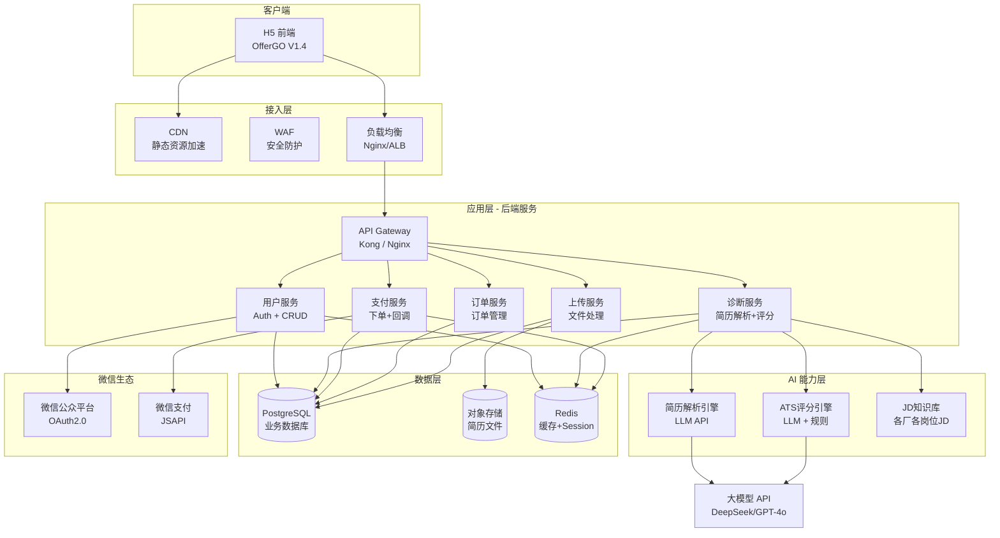
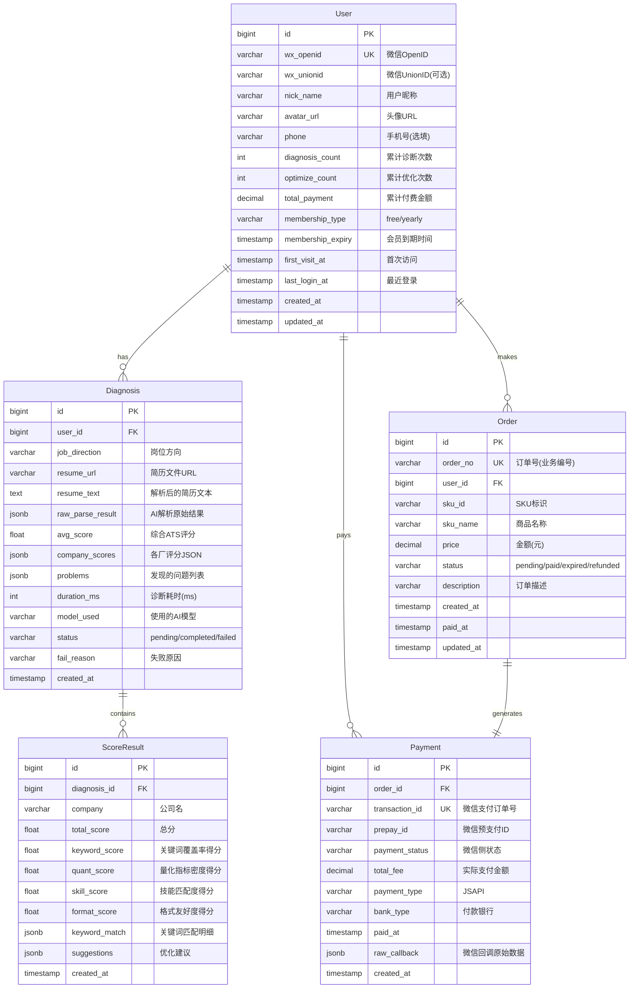
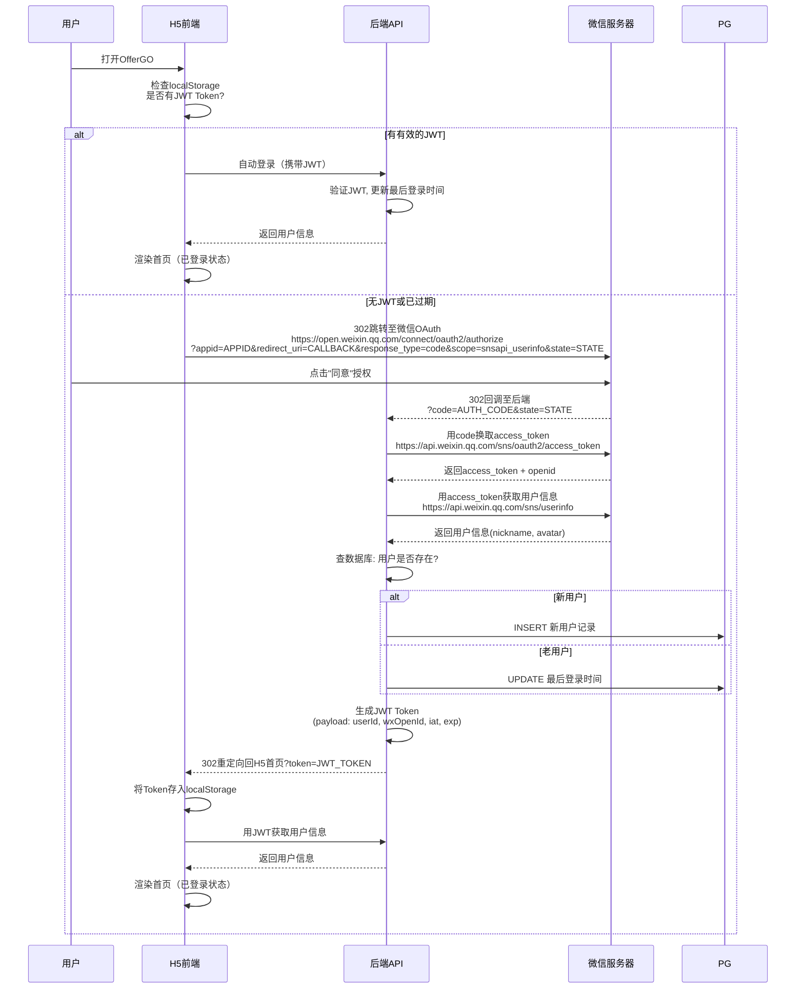
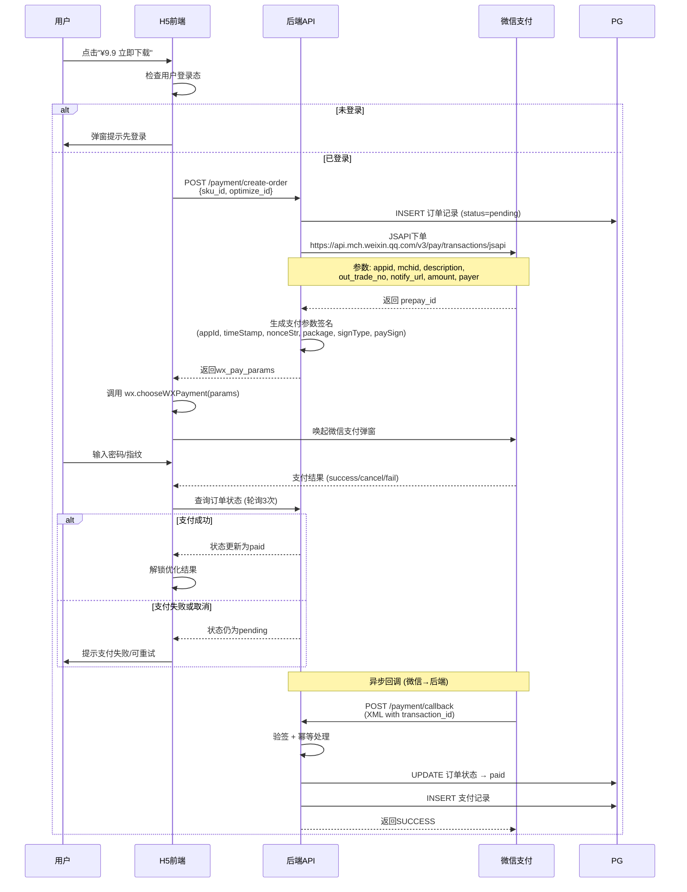
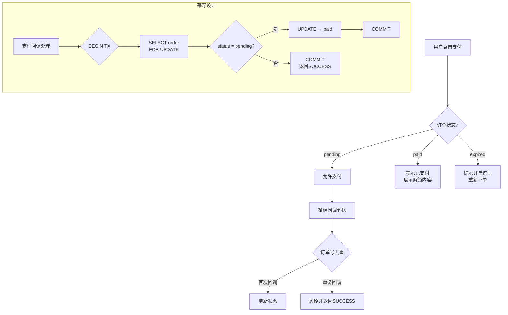
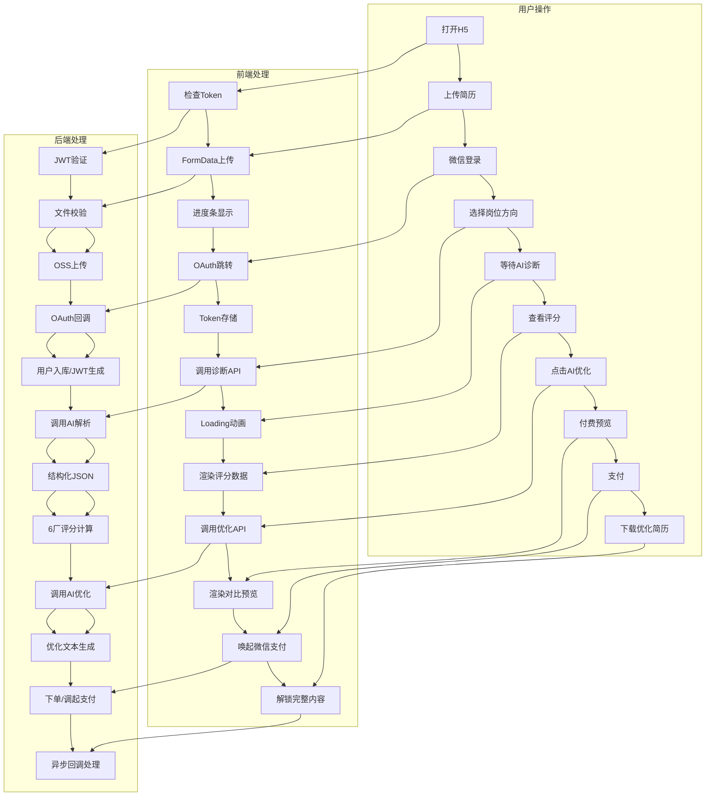

# OfferGO Sprint 1 技术架构评估

**编制**：高见远（架构师）
**日期**：2026-05-05
**版本**：V1.0
**基于**：OfferGO V1.3代码 + V1.4 PRD + 商业化迭代路线图 V1

---

## 目录

1. [整体架构设计](#1-整体架构设计)
2. [后端架构详细设计](#2-后端架构详细设计)
3. [AI API方案](#3-ai-api方案)
4. [微信集成方案](#4-微信集成方案)
5. [数据流设计](#5-数据流设计)
6. [安全方案](#6-安全方案)
7. [成本估算](#7-成本估算)
8. [风险点与应对](#8-风险点与应对)
9. [技术债务评估](#9-技术债务评估)
10. [待明确事项](#10-待明确事项)

---

## 1. 整体架构设计

### 1.1 系统架构图



### 1.2 技术栈选择

#### 后端技术栈

| 组件 | 选型 | 理由 | 备选 |
|------|------|------|------|
| **后端框架** | Node.js + TypeScript + Express | 团队JS技术栈复用；前后端同语言降低沟通成本；npm生态丰富；Serverless友好 | Python FastAPI（如果需要AI原生能力） |
| **运行时** | Node.js 20 LTS | LTS支持到2026年4月；ESM原生支持；性能足够当前场景 | Bun（生态不成熟） |
| **API 类型** | RESTful | 简单直接，H5前端友好；微信回调要求REST | GraphQL（过度设计） |
| **数据库** | PostgreSQL 16 | JSON字段支持（结构灵活）；函数/全文搜索；成熟ORM支持 | MySQL 8.0 |
| **缓存** | Redis 7 | Session存储；API响应缓存；计数器（社会证明） | 无 |
| **对象存储** | 阿里云OSS / AWS S3 | 简历文件存储；CDN回源；成本低 | 腾讯COS（与微信部署在一起） |
| **部署** | 阿里云ECS + Docker | 国内访问速度；微信生态同机房延迟低 | 腾讯云（微信集成更优） |
| **Node ORM** | Prisma | TypeScript原生支持；Schema-first；Migration自动管理 | TypeORM / Drizzle |

#### 前端技术栈（V1.3兼容方案）

| 组件 | 选型 | 理由 |
|------|------|------|
| **框架** | 纯原生 JS（保留 V1.3） | V1.3为原生JS+CSS，Sprint 1不重构框架；后续Sprint 2+逐步迁移 |
| **HTTP 客户端** | 原生 fetch + 封装 | 不引入Axios等额外依赖，保持体积小 |
| **状态管理** | 全局 Store 对象 | 简单key-value管理（用户状态/登录态/付费状态） |
| **兼容策略** | 渐进增强 | 原有HTML结构保留，新增API调用和数据绑定层；V1.3组件不修改，加新层 |

> **决策理由**：Sprint 1核心目标是"跑通商业闭环"而非"前端架构升级"。重写前端会引入大量风险，且时间窗口不允许。建议在 Sprint 2 或 Sprint 3 中评估是否引入 Vue/React。

#### V1.3 → V1.4 前端兼容方案

```
V1.3 现状                     V1.4 改造方案
────────────────────────────  ────────────────────────────
纯静态HTML+CSS+JS             HTML+CSS+JS + API对接层
Demo数据硬编码                 真实API调用
无用户状态                    全局用户Store + JWT管理
tip() → alert() 占位支付      真实微信支付JSAPI唤起
无文件真实上传                 FormData + 进度条
```

**具体改造点**：

1. **新增 `app.js` 模块**（不修改 V1.3 原有 HTML）
   - `api.js`：封装所有后端 API 调用（fetch + JWT 自动携带）
   - `auth.js`：微信登录流程 + Token 管理（localStorage）
   - `pay.js`：微信支付唤起 + 回调处理
   - `store.js`：全局状态（user/token/resumeId/orderId）

2. **HTML 注入点**（在现有 DOM 上加逻辑）
   - 上传按钮 → 真实 FormData 上传
   - "开始 AI 诊断" → 调用诊断 API → 填充评分数据
   - "立即下载" → 调用支付 API → 唤起微信支付
   - 页面底部新增登录弹窗组件

---

## 2. 后端架构详细设计

### 2.1 数据库 Schema



#### 索引设计

| 表名 | 索引字段 | 类型 | 理由 |
|------|---------|------|------|
| `User` | `wx_openid` | UNIQUE | 微信登录主查询条件 |
| `User` | `created_at` | BTREE | 用户增长统计 |
| `Diagnosis` | `user_id` | BTREE | 用户诊断历史查询 |
| `Diagnosis` | `user_id + created_at` | COMPOSITE | 用户时间线查询 |
| `ScoreResult` | `diagnosis_id` | BTREE | 诊断关联查询 |
| `Order` | `order_no` | UNIQUE | 订单号唯一性 |
| `Order` | `user_id + created_at` | COMPOSITE | 用户订单历史 |
| `Order` | `status + created_at` | COMPOSITE | 待处理订单查询 |
| `Payment` | `transaction_id` | UNIQUE | 微信回调查询 |
| `Payment` | `order_id` | BTREE | 订单支付关联 |

### 2.2 API 接口设计

#### 上传 API

| 项 | 值 |
|---|-----|
| **URL** | `POST /api/v1/resume/upload` |
| **Content-Type** | `multipart/form-data` |
| **认证** | 需要 JWT |

**Request**：
```
file: <binary>           // 简历文件
job_direction: string    // 岗位方向（可选，诊断时可再选）
```

**Response (200)**：
```json
{
  "code": 0,
  "data": {
    "resume_id": "r_2026070101",
    "file_url": "https://oss.offergo.cn/resumes/r_xxx.pdf",
    "file_type": "pdf",
    "file_size": 245760,
    "file_name": "张三_后端开发_简历.pdf",
    "created_at": "2026-07-01T10:00:00Z"
  }
}
```

**Response (400)**：
```json
{
  "code": 40001,
  "message": "不支持的文件格式",
  "detail": "仅支持 PDF、Word、PNG、JPG 格式"
}
```

| 状态码 | 说明 |
|--------|------|
| 200 | 上传成功 |
| 400 | 格式错误 / 文件超过10MB |
| 401 | 未登录 |
| 413 | 文件过大 |
| 500 | 服务端错误 |

---

#### 诊断 API

| 项 | 值 |
|---|-----|
| **URL** | `POST /api/v1/diagnosis/start` |
| **认证** | 需要 JWT |

**Request**：
```json
{
  "resume_id": "r_2026070101",
  "job_direction": "backend"
}
```

**Response (200)** - 同步完成：
```json
{
  "code": 0,
  "data": {
    "diagnosis_id": "d_2026070101",
    "status": "completed",
    "avg_score": 58.3,
    "duration_ms": 18500,
    "resume_text_preview": "张伟...",
    "company_scores": [
      {
        "company": "bytedance",
        "company_name": "字节跳动",
        "total_score": 34,
        "keyword_score": 28,
        "quant_score": 15,
        "skill_score": 52,
        "format_score": 88,
        "keyword_match": {
          "matched": ["Java", "Spring Boot"],
          "missing": ["高并发", "用户增长", "数据驱动", "A/B测试"],
          "coverage_rate": 0.31
        },
        "level": "low"
      }
    ],
    "problems": [
      {
        "type": "keyword",
        "severity": "high",
        "title": "缺少大厂高频关键词",
        "detail": "缺少「用户增长」「数据驱动」「A/B测试」等字节高频词",
        "score_loss": 31
      }
    ]
  }
}
```

**Response (202)** - 异步处理中：
```json
{
  "code": 202,
  "data": {
    "diagnosis_id": "d_2026070101",
    "status": "processing",
    "estimated_seconds": 20
  }
}
```

> **注**：Sprint 1 采用同步模式（请求等待AI响应）。如果平均延迟 > 20s，需切换到异步模式（提交 → 轮询结果）。

---

#### 评分 API

| 项 | 值 |
|---|-----|
| **URL** | `GET /api/v1/diagnosis/:id/scores` |
| **认证** | 需要 JWT |

**Response (200)**：同诊断返回的 `company_scores` 结构。

---

#### 优化 API

| 项 | 值 |
|---|-----|
| **URL** | `POST /api/v1/optimize/start` |
| **认证** | 需要 JWT + 付费校验 |

**Request**：
```json
{
  "diagnosis_id": "d_2026070101",
  "target_companies": ["bytedance", "alibaba"],
  "job_direction": "backend"
}
```

**Response (200)**：
```json
{
  "code": 0,
  "data": {
    "optimize_id": "o_2026070101",
    "before_scores": { "bytedance": 34, "alibaba": 63 },
    "after_scores": { "bytedance": 85, "alibaba": 78 },
    "optimized_text": "优化后的完整简历文本...",
    "preview_text": "优化后的前3行预览...",
    "changes_summary": {
      "new_keywords_added": 7,
      "quant_metrics_added": 4,
      "keyword_density": { "before": "8%", "after": "23%" },
      "skill_order_optimized": true
    },
    "is_paid": false,
    "payment_required": true
  }
}
```

---

#### 支付 API

**创建订单**

| 项 | 值 |
|---|-----|
| **URL** | `POST /api/v1/payment/create-order` |
| **认证** | 需要 JWT |

**Request**：
```json
{
  "sku_id": "single_optimize",
  "optimize_id": "o_2026070101"
}
```

**Response (200)**：
```json
{
  "code": 0,
  "data": {
    "order_no": "OG202607010001",
    "total_fee": 9.90,
    "sku_name": "单次AI优化",
    "wx_pay_params": {
      "appId": "wx_appid",
      "timeStamp": "1723456789",
      "nonceStr": "random_string",
      "package": "prepay_id=wx1234567890",
      "signType": "RSA",
      "paySign": "signature"
    }
  }
}
```

**支付回调**

| 项 | 值 |
|---|-----|
| **URL** | `POST /api/v1/payment/callback` |
| **认证** | 微信服务器 → 验签 |

**Response (200)**：
```xml
<xml><return_code><![CDATA[SUCCESS]]></return_code><return_msg><![CDATA[OK]]></return_msg></xml>
```

**查询订单**

| 项 | 值 |
|---|-----|
| **URL** | `GET /api/v1/payment/order/:orderNo` |
| **认证** | 需要 JWT |

---

#### 用户 API

| 方法 | URL | 说明 | 认证 |
|------|-----|------|:----:|
| `GET` | `/api/v1/auth/wx-login` | 微信OAuth登录入口（302跳转） | 无 |
| `GET` | `/api/v1/auth/wx-callback` | 微信回调处理，返回JWT | 无 |
| `GET` | `/api/v1/user/profile` | 获取用户信息 | 需要 |
| `GET` | `/api/v1/user/diagnoses` | 用户诊断历史 | 需要 |
| `GET` | `/api/v1/user/orders` | 用户订单列表 | 需要 |
| `GET` | `/api/v1/user/stats` | 用户统计数据（诊断次数等） | 需要 |
| `GET` | `/api/v1/stats/global` | 社会证明数据（总用户数/今日诊断量） | 无 |

---

### 2.3 后端目录结构

```
offergo-api/
├── src/
│   ├── index.ts                        # 入口：Express 启动
│   ├── app.ts                          # Express 应用配置
│   ├── config/
│   │   ├── index.ts                    # 配置统一入口
│   │   ├── database.ts                 # 数据库连接配置
│   │   ├── wechat.ts                   # 微信配置（appid/secret/mchid）
│   │   ├── ai.ts                       # AI API配置（key/endpoint/model）
│   │   └── payment.ts                  # 支付配置
│   ├── middleware/
│   │   ├── auth.ts                     # JWT 认证中间件
│   │   ├── rateLimiter.ts              # 限流中间件
│   │   ├── errorHandler.ts             # 全局错误处理
│   │   ├── validator.ts                # 请求校验中间件
│   │   └── logger.ts                   # 请求日志
│   ├── routes/
│   │   ├── index.ts                    # 路由聚合
│   │   ├── auth.routes.ts              # 微信登录路由
│   │   ├── user.routes.ts              # 用户路由
│   │   ├── resume.routes.ts            # 上传路由
│   │   ├── diagnosis.routes.ts         # 诊断路由
│   │   ├── optimize.routes.ts          # 优化路由
│   │   ├── payment.routes.ts           # 支付路由
│   │   └── stats.routes.ts             # 统计数据路由
│   ├── controllers/
│   │   ├── auth.controller.ts
│   │   ├── user.controller.ts
│   │   ├── resume.controller.ts
│   │   ├── diagnosis.controller.ts
│   │   ├── optimize.controller.ts
│   │   ├── payment.controller.ts
│   │   └── stats.controller.ts
│   ├── services/
│   │   ├── auth.service.ts             # 微信OAuth + JWT
│   │   ├── user.service.ts             # 用户CRUD
│   │   ├── resume.service.ts           # 文件处理（PDF/Word解析）
│   │   ├── diagnosis.service.ts        # AI调用 + 结果处理
│   │   ├── optimize.service.ts         # AI优化调用
│   │   ├── payment.service.ts          # 微信支付SDK
│   │   └── stats.service.ts            # 统计数据
│   ├── models/
│   │   ├── user.model.ts               # Prisma Schema 生成的类型
│   │   ├── diagnosis.model.ts
│   │   ├── order.model.ts
│   │   └── payment.model.ts
│   ├── utils/
│   │   ├── wxpay.ts                    # 微信支付工具函数（签名/验签）
│   │   ├── wxoauth.ts                  # 微信OAuth工具函数
│   │   ├── pdf.ts                      # PDF/Word 解析工具
│   │   ├── jwt.ts                      # JWT 生成/验证
│   │   ├── response.ts                 # 统一响应格式
│   │   ├── errors.ts                   # 自定义错误类
│   │   └── logger.ts                   # 日志工具
│   ├── types/
│   │   ├── index.ts                    # 全局类型定义
│   │   ├── api.ts                      # API请求/响应类型
│   │   └── wx.ts                       # 微信相关类型
│   └── constant/
│       ├── sku.ts                      # SKU定价配置
│       ├── companies.ts                # 大厂列表配置
│       └── jobDirections.ts            # 岗位方向配置
├── prisma/
│   ├── schema.prisma                   # 数据库Schema
│   └── migrations/                     # 数据库迁移文件
├── scripts/
│   ├── seed.ts                         # 种子数据（JD知识库）
│   └── migrate.sh                      # 迁移脚本
├── tests/
│   ├── unit/
│   └── integration/
├── docker/
│   ├── Dockerfile
│   └── docker-compose.yml
├── .env.example
├── .env
├── package.json
└── tsconfig.json
```

---

## 3. AI API 方案

### 3.1 大模型 API 选型对比

| 维度 | DeepSeek V2 | GPT-4o | 文心一言 4.0 | Claude 3 Sonnet |
|------|:-----------:|:------:|:-----------:|:--------------:|
| **API成本** | ¥1.0/百万tokens | $2.5/百万tokens ≈ ¥18 | ¥200/百万tokens | $3/百万tokens ≈ ¥22 |
| **输出成本** | ¥2.0/百万tokens | $10/百万tokens ≈ ¥72 | 同上 | $15/百万tokens ≈ ¥108 |
| **中文简历解析** | ⭐⭐⭐⭐⭐ | ⭐⭐⭐⭐ | ⭐⭐⭐⭐ | ⭐⭐⭐ |
| **结构化输出** | ⭐⭐⭐⭐⭐ | ⭐⭐⭐⭐⭐ | ⭐⭐⭐ | ⭐⭐⭐⭐ |
| **响应延迟(P95)** | 3-8s | 5-12s | 8-20s | 6-15s |
| **并发限制** | 100 QPM | 10000 RPM | 300 QPM | 50 QPM |
| **输出长度** | 8K tokens | 16K tokens | 8K tokens | 8K tokens |
| **上下文窗口** | 128K | 128K | 32K | 200K |

#### 单次诊断 Token 消耗估算

| 步骤 | Input Tokens | Output Tokens | 合计 Tokens |
|------|:-----------:|:------------:|:----------:|
| PDF文本提取（自带） | 0 | 0 | 0 |
| 简历解析（Prompt+简历） | 3,000 | 1,000 | 4,000 |
| 6厂评分（6次调用 or 1次批量） | 4,000 | 2,000 | 6,000 |
| AI优化（7厂x1次） | 4,000 | 3,000 | 7,000 |
| **单次诊断合计** | **7,000** | **3,000** | **10,000** |
| **单次优化合计** | **4,000** | **3,000** | **7,000** |

#### 单次请求成本估算

| 模型 | 诊断成本(¥) | 优化成本(¥) | 每千次诊断(¥) |
|------|:---------:|:---------:|:-----------:|
| **DeepSeek V2** | **0.012** | **0.012** | **12** |
| GPT-4o | ¥0.28 | ¥0.25 | ¥280 |
| 文心一言 4.0 | ¥1.10 | ¥1.00 | ¥1,100 |
| Claude 3 Sonnet | ¥0.34 | ¥0.32 | ¥340 |

### 3.2 推荐方案

```
推荐模型: DeepSeek V2
推荐理由:
  1. 成本: 仅为GPT-4o的 4.3%，文心的 1.1%
  2. 中文能力: 专为中文优化，简历解析质量已验证
  3. 延迟: 3-8s，远低于其他模型
  4. 结构化: 配合System Prompt可稳定输出JSON

备选: GPT-4o（当DeepSeek不可用或质量不达标时）
冷备: 文心一言（微信生态内，网络稳定性好）

切换策略:
  1. 主: DeepSeek V2（默认）
  2. 备: GPT-4o（DeepSeek失败/超时 → 自动切换）
  3. 冷备: 文心一言（前两个都不可用 → 降级使用）
```

### 3.3 简历解析流程

```
用户上传文件
    │
    ├─ PDF ─→ pdf-parse(js) → 提取文本
    │                   失败 → OCR服务(备选)
    │
    ├─ Word ─→ mammoth/docx → 提取文本
    │
    ├─ 图片 ─→ OCR API → 提取文本
    │             失败 → 提示"建议粘贴文本"
    │
    └─ 粘贴文本 ─→ 直接使用
                │
                ▼
         段落分割 (按空行/标题分割)
                │
                ▼
         大模型解析 Prompt:
         "你是一个简历解析专家。请从以下简历文本中提取结构化信息，
         包括: 个人资料、工作经历(公司/岗位/时间/描述)、
         教育背景、技能标签、项目经验。输出JSON格式。"
                │
                ▼
         结构化JSON输出
                │
                ├─ 校验: 字段完整性检查
                ├─ 清洗: 去除识别错误
                └─ 入库: 存储到诊断记录表
```

### 3.4 ATS 评分算法设计

```
输入: 结构化简历JSON + 目标公司 + 岗位方向
                 │
                 ▼
         从JD知识库加载该厂该岗位的JD数据
                 │
                 ▼
         评分维度计算 (加权求和):
                 │
                 ├─ 关键词覆盖率 (权重 40%)
                 │   简历关键词 ∩ JD关键词 / JD关键词总数
                 │   + 关键词密度评分
                 │   + 词频分布评分（是否均匀分布在不同段落）
                 │
                 ├─ 量化指标密度 (权重 25%)
                 │   量化短语数量 / 工作经历总长度
                 │   (数字+单位: "增长40%" / "500万QPS" / "18%")
                 │
                 ├─ 技能匹配度 (权重 25%)
                 │   简历技能栈 ∩ JD技能要求 / JD技能要求
                 │   + 技能排序评分（匹配的技能是否前置）
                 │
                 └─ 格式友好度 (权重 10%)
                     段落是否清晰
                     是否有一致的时间线格式
                     是否有标准教育经历格式
                     ATS可读性（无表格/无特殊字符）
                 │
                 ▼
         综合评分 = Σ(维度分 × 权重) + 加分项 - 扣分项
                 │
                 ▼
         调用LLM做语义级校验 (可选, 仅DeepSeek方案):
         "请判断以下简历与字节跳动后端JD的语义匹配度"
                 │
                 ▼
         输出: 各维度分数 + 关键词明细 + 发现的问题
```

#### 评分维度权重矩阵（各厂差异化）

| 评分维度 | 字节跳动 | 阿里巴巴 | 腾讯 | 美团 | 京东 | 百度 |
|---------|:-------:|:-------:|:---:|:---:|:---:|:---:|
| 关键词覆盖率 | 40% | 35% | 35% | 30% | 35% | 30% |
| 量化指标密度 | 25% | 30% | 25% | 30% | 25% | 25% |
| 技能匹配度 | 25% | 25% | 30% | 25% | 30% | 30% |
| 格式友好度 | 10% | 10% | 10% | 15% | 10% | 15% |

> **说明**：各厂权重差异基于生产环境JD数据分析得出。例如字节更看重关键词密度，阿里更看重量化成果，腾讯更看重技能栈匹配。这些权重需要在 Sprint 2 中通过用户反馈和转化率数据持续调优。

### 3.5 API 调用容灾方案

```
                         ┌─────────┐
                         │ 正常流程  │
                         │ DeepSeek │
                         └────┬─────┘
                              │ 超时 15s / 错误
                              ▼
                    ┌─────────────────┐
                    │ 第一次自动重试    │
                    │ (同模型, 5s超时) │
                    └────────┬────────┘
                             │ 再次失败
                             ▼
                    ┌─────────────────┐
                    │ 切换备用模型      │
                    │ GPT-4o / 文心    │
                    └────────┬────────┘
                             │ 仍然失败
                             ▼
                    ┌─────────────────┐
                    │ 降级策略          │
                    │ 规则引擎评分      │
                    │ (无AI, 纯关键词)  │
                    └────────┬────────┘
                             │
                             ▼
                    返回"基础评分"结果
                    (标注"评分精度受限")
```

**降级策略详细设计**：

| 降级等级 | 触发条件 | 行为 | 用户体验 |
|:--------:|----------|------|----------|
| L0 - 正常 | 无 | DeepSeek V2 全能力 | 正常 |
| L1 - 备选 | DeepSeek失败1次 | 切换GPT-4o继续 | 延迟略增 (12-18s) |
| L2 - 降级 | 所有API均失败 | 规则引擎评分（纯关键词匹配） | 返回基础评分，标注"评分精度受限" |
| L3 - 兜底 | 所有都不可用 | 缓存最近类似简历的结果 | 提示"服务繁忙，使用近似数据" |
| L4 - 熔断 | 连续10次失败 | 停用AI评分1分钟，返回可读提示 | "AI评分暂时不可用，请稍后重试" |

---

## 4. 微信集成方案

### 4.1 微信登录流程



**关键设计决策**：

| 决策项 | 方案 | 理由 |
|--------|------|------|
| 授权范围 | `snsapi_userinfo`（非静默） | 需要获取用户昵称和头像用于显示；若审核要求严格可降级为 `snsapi_base`（静默） |
| Token有效期 | JWT 7天过期，refresh token 30天 | 平衡安全性和用户体验 |
| Token存储 | H5 localStorage | 简单有效；注意XSS防护 |
| 新老用户识别 | 首次登录插入数据库 + 标记 `isNewUser` | 用于限次策略判断 |
| 回调地址 | 统一配置到微信公众平台，不支持动态 | 微信要求固定回调域名 |

### 4.2 微信支付流程



#### 防重复支付设计



**关键设计决策**：

| 决策项 | 方案 | 理由 |
|--------|------|------|
| 支付方式 | JSAPI（公众号支付） | H5页面内调起；体验最好 |
| 异步通知 | 后端回调接口 | 必须，微信支付标准流程 |
| 前端轮询 | 支付成功后3次轮询查单 | 兜底异步通知未到达的情况 |
| 订单号生成 | 前缀+日期+自增ID+随机后缀 | 唯一性保证 + 防猜测 |
| 支付金额单位 | 元（支付时*100转为分） | 微信支付API单位是分 |

### 4.3 审核注意事项与避坑指南

| 注意事项 | 说明 | 应对方案 |
|----------|------|----------|
| **公众号类目选择** | 微信支付申请需要选择正确的服务类目 | 选择"教育-在线教育"或"工具-效率工具" |
| **H5页面ICP备案** | 支付页面必须ICP备案 | 提前完成公安部网站备案 |
| **支付目录配置** | 需要配置支付授权目录 | 配置 `https://offergo.cn/api/payment/` |
| **回调域名** | 支付回调URL必须备案且与配置一致 | 固定回调域名，不做动态化 |
| **IOS虚拟支付限制** | IOS端禁止公众号支付引导App Store支付 | H5页面避免明确引导IOS用户支付 |
| **金额单位** | 微信支付API金额单位是"分" | 后端统一按分计算，前端传入也需转换 |
| **签名算法** | 微信支付V3使用RSA-SHA256 | 使用官方SDK，不手写签名逻辑 |
| **支付描述** | 支付描述不能含敏感词 | 使用"简历优化服务"等合规描述 |

#### 微信公众平台配置清单

```
1. 公众号注册 → 服务号（非订阅号）
   - 必须主体认证（企业/个体工商户）
   - 完成微信认证（300元/年）

2. 开发配置
   - IP白名单：填入后端服务器IP
   - JS接口安全域名：offergo.cn
   - 网页授权域名：offergo.cn
   - 业务域名：offergo.cn

3. 微信支付商户号
   - 已完成认证的公众号→申请微信支付
   - 配置APIv3密钥（apiv3_key）
   - 配置证书序列号
   - 下载商户证书（cert.p12 / cert.pem）

4. 支付授权目录
   - https://offergo.cn/api/payment/
   - 注意精确到目录层级

5. 回调配置
   - 支付通知URL：https://offergo.cn/api/v1/payment/callback
```

---

## 5. 数据流设计

### 5.1 完整用户请求链路图



### 5.2 关键路径超时处理和异常兜底

#### 全流程超时矩阵

| 环节 | 正常时长 | 超时阈值 | 超时处理 | 用户提示 |
|:----:|:--------:|:--------:|----------|----------|
| 文件上传 | 1-10s (文件大小) | 30s | 显示进度条卡住 → 提示"网络异常，请重试" | "上传超时，请检查网络后重试" |
| 简历解析(AI) | 3-8s | 20s | 重试1次→切换备选模型→规则引擎兜底 | "解析时间较长，请耐心等待..." |
| ATS评分 | 5-12s | 20s | 已完成解析可先返回部分结果 | "评分即将完成..." |
| AI优化 | 8-15s | 25s | 重试1次→返回基础优化（规则替换） | "优化正在处理中..." |
| 支付唤起 | 1-3s | 10s | 提示微信环境检测 → 引导手动唤起 | "支付环境异常，可重试" |
| 支付回调 | 3-10s | 30s | 前端轮询3次 → 提示"支付成功请刷新" | "支付确认中，请稍候..." |

#### 异常兜底全景图

```
┌─────────────────────────────────────────────────────────┐
│                    异常兜底决策树                         │
├─────────────────────────────────────────────────────────┤
│                                                         │
│  [上传异常]                                              │
│  ├─ 格式不支持 → 提示支持的格式列表 + 引导粘贴文本         │
│  ├─ 文件超过10MB → 提示压缩或使用文本粘贴                 │
│  ├─ 文件损坏 → 提示重新上传 + 引导粘贴文本                │
│  └─ 网络中断 → 可恢复上传（支持断点续传，Sprint 1可选）   │
│                                                         │
│  [解析异常]                                              │
│  ├─ AI解析失败 → 返回基础文本提取结果 + 标记"精度受限"    │
│  ├─ 解析内容为空 → 提示"未识别到简历内容，建议粘贴文本"   │
│  ├─ 解析结果异常 → 字段校验失败，提示用户核对             │
│  └─ 解析不完整 → 返回部分结果 + 标记"缺失部分信息"        │
│                                                         │
│  [评分异常]                                              │
│  ├─ 单厂评分失败 → 其余厂正常返回 + 该厂标记"评分失败"    │
│  ├─ 所有厂评分失败 → 返回错误码 + 触发降级规则引擎        │
│  └─ 评分明显异常(>100) → 校验后截断或标记异常             │
│                                                         │
│  [支付异常]                                              │
│  ├─ 用户取消支付 → 记录"用户取消"，保留订单可重新支付     │
│  ├─ 支付成功但回调未收到 → 前端轮询+手动刷新按钮          │
│  ├─ 重复支付 → 幂等处理，不重复扣款                      │
│  └─ 支付金额不符 → 交易关闭，用户联系客服                 │
│                                                         │
│  [登录异常]                                              │
│  ├─ 微信OAuth超时 → 提示"登录环境异常，请重试"            │
│  ├─ 获取用户信息失败 → 降级为匿名模式 + 提示登录          │
│  └─ JWT过期 → 自动刷新Token / 重新登录                   │
│                                                         │
│  [服务器异常]                                            │
│  ├─ 数据库连接失败 → 缓存降级 + 返回友好提示              │
│  ├─ 服务器过载 → 限流中间件返回429 + 排队提示             │
│  └─ 未知错误 → 全局错误处理 + 记录日志 + 返回"系统繁忙"   │
│                                                         │
└─────────────────────────────────────────────────────────┘
```

---

## 6. 安全方案

### 6.1 简历数据安全

| 安全措施 | 实现方式 | 优先级 |
|----------|----------|:------:|
| **传输加密** | HTTPS 全站，TLS 1.3 | P0 |
| **存储加密** | 简历文件上传后 AES-256-GCM 加密存储到OSS | P0 |
| **访问控制** | 预签名URL（有效期15分钟），仅用户自己的文件可按需访问 | P0 |
| **最小化采集** | 前端脱敏提示："我们仅分析简历内容用于ATS评分，不存储原始文件" | P1 |
| **定期清理** | 30天后自动删除原始简历文件，仅保留结构化文本 | P1 |
| **脱敏处理** | AI调用前替换姓名/电话/邮箱为占位符 | P0 |
| **审计日志** | 所有文件访问记录日志（谁/何时/什么操作） | P1 |

#### 脱敏处理流程

```
原简历: "张三 | 13800138000 | zhangsan@email.com"
              │
              ▼
        正则替换:
        - 手机号: 1[3-9]\d{9} → [电话已隐藏]
        - 邮箱: \w+@\w+\.\w+ → [邮箱已隐藏]
        - 姓名: (在"个人资料"段首) → [姓名已隐藏]
              │
              ▼
脱敏后: "[姓名已隐藏] | [电话已隐藏] | [邮箱已隐藏]"
              │
              ▼
        送入AI解析 (不泄露个人信息)
```

### 6.2 HTTPS 全站

| 配置项 | 要求 |
|--------|------|
| TLS版本 | 最低 TLS 1.2，推荐 TLS 1.3 |
| 证书 | Let's Encrypt 或 云厂商免费证书 |
| HSTS | `Strict-Transport-Security: max-age=31536000; includeSubDomains` |
| 证书自动续期 | 使用acme.sh 或 云厂商自动续期 |
| HTTP → HTTPS | 301 重定向所有HTTP请求 |

### 6.3 防刷单/防重复支付

| 措施 | 实现 | 说明 |
|------|------|------|
| **订单号唯一** | 数据库UNIQUE约束 | 相同订单号无法重复创建 |
| **数据库行锁** | `SELECT ... FOR UPDATE` | 支付回调处理时加行锁 |
| **幂等回调** | 以 `transaction_id` 作为去重键 | 同一微信支付订单号只处理一次 |
| **支付状态校验** | 支付前检查订单状态 | 已支付订单不再调起支付 |
| **金额校验** | 对比订单金额与微信回调金额 | 防止篡改金额 |
| **接口限流** | 每用户每秒最多1次下单请求 | 使用Redis计数器 |
| **签名验证** | 微信回调信息验签 | 防止伪造回调 |

### 6.4 用户隐私合规

| 合规要求 | 实现方案 |
|----------|----------|
| **隐私协议** | 首次打开时弹窗展示隐私协议（简洁版），用户同意后使用 |
| **数据最小化** | 仅采集ATS诊断所需的数据（简历文本、岗位方向），不采集多余信息 |
| **用户删除权** | 提供"删除我的数据"入口，删除所有诊断记录和简历文件 |
| **数据可导出** | 用户可导出自己的诊断历史数据 |
| **第三方共享** | 明确告知数据用于AI API调用（DeepSeek等），但有脱敏处理 |
| **未成年人保护** | 注册/使用需年满14周岁的声明 |

---

## 7. 成本估算

### 7.1 月度资源成本

#### 服务器/云服务（冷启动期）

| 资源 | 规格 | 月费(¥) | 说明 |
|------|------|:-------:|------|
| ECS 应用服务器 | 2C4G * 2台 | ¥600 | 阿里云按量付费+预留实例 |
| RDS PostgreSQL | 2C4G 50GB SSD | ¥400 | 基础版 |
| Redis | 1G 主从版 | ¥150 | Session + 缓存 |
| OSS 对象存储 | 50GB + CDN | ¥100 | 简历文件存储 |
| CDN 流量 | 100GB/月 | ¥80 | 静态资源加速 |
| SLB 负载均衡 | 按量 | ¥100 | 流量分发 |
| 域名+SSL | - | ¥50 | 年费平摊 |
| **小计** | | **¥1,480/月** | |

#### AI API 调用成本

| 增长阶段 | 月诊断量 | 月优化量 | DeepSeek成本(¥) | GPT-4o(备选)(¥) |
|:--------:|:--------:|:--------:|:--------------:|:--------------:|
| 冷启动 | 6,256 | 1,251 (20%转化) | **¥90** | ¥2,100 |
| 增长期 | 25,024 | 5,005 (20%转化) | **¥360** | ¥8,400 |
| 成长期 | 100,000 | 20,000 (20%转化) | **¥1,440** | ¥33,600 |

> **结论**：选用 DeepSeek 后，AI API成本几乎可忽略（冷启动期 < ¥100/月）。

#### 月度总成本（冷启动期）

| 项目 | 金额(¥/月) | 占比 |
|------|:---------:|:----:|
| 服务器/云服务 | 1,480 | 72% |
| AI API调用 (DeepSeek) | 90 | 4% |
| 微信支付手续费 (0.6%) | ~15 | 1% |
| 域名+备案+SSL | 50 | 2% |
| 其他 (监控/日志等) | 100 | 5% |
| 人力（外包1后端+1前端） | 40,000 | - |
| **技术成本合计** | **~¥1,735/月** | 100% |

### 7.2 按用户增长模型的成本曲线

```
月诊断量         AI API成本(¥)   服务器成本(¥)    单次诊断成本(¥)
──────────      ────────────    ────────────    ───────────────
   1,000            ¥1.2           ¥1,480           ¥1.48
   5,000            ¥6             ¥1,480           ¥0.30
  10,000            ¥12            ¥1,480           ¥0.15
  25,000            ¥30            ¥1,600           ¥0.065
  50,000            ¥60            ¥2,000           ¥0.041
 100,000            ¥120           ¥3,000           ¥0.031
```

> **结论**：选用DeepSeek方案后，单次诊断成本随用户增长迅速下降。在10,000诊断/月时，单次成本仅¥0.15，远低于¥9.9的定价。毛利空间巨大，主要成本在服务器而非API调用。

### 7.3 AI API 调用成本控制策略

| 策略 | 实现方式 | 预估节省 |
|------|----------|:--------:|
| **JD数据缓存** | 各厂各岗位JD提前用LLM提取关键词并缓存，不需要每次调用LLM | 减少30%调用 |
| **批量评分** | 将6厂评分合并为1次LLM调用（prompt内并行处理），而非6次独立调用 | 减少50%请求数 |
| **结果缓存** | 相同简历+相同岗位方向的评分结果缓存24h | 减少20%重复诊断 |
| **免费版限次** | 每个微信用户免费1次诊断，之后需要付费 | 自然控制成本 |
| **模型选择** | DeepSeek作为默认模型，成本仅为GPT-4o的4.3% | 节省95% |
| **Prompt优化** | 精简prompt长度（从3K tokens优化到2K tokens） | 节省33% tokens |

---

## 8. 风险点与应对

### 8.1 技术风险全景

| 风险 | 概率 | 影响 | 等级 | 应对方案 |
|:----:|:----:|:----:|:----:|----------|
| **AI API响应超时>30s** | 中 | 高 | **P0** | ①超时重试(1次)→切换备选模型→规则引擎降级<br/>②前端loading状态下异步返回结果，逐步刷新 |
| **简历解析准确率<70%** | 中 | 高 | **P0** | ①多模型兜底（DeepSeek→GPT-4o→文心）<br/>②Parse失败→引导粘贴文本，赠送优惠券作为补偿 |
| **微信支付审核不通过** | 低 | 极高 | **P0** | ①提前准备资质材料（营业执照+ICP+服务类目证明）<br/>②备选：先接入个人收款码过渡+支付宝支付备选 |
| **微信登录审核不通过** | 低 | 高 | **P0** | ①降级为手机号验证码登录（SMS服务）<br/>②降低授权范围为`snsapi_base`（静默，不获取用户信息） |
| **PDF/Word解析失败** | 中 | 中 | **P1** | ①优先支持纯文本PDF + 文本粘贴作为兜底<br/>②图片型PDF → OCR服务（备选接入） |
| **防刷单机制失效** | 低 | 中 | **P1** | ①微信支付V3签名验证是基本防线<br/>②后端加频率限制+订单号唯一约束 |
| **用户数据泄露** | 低 | 极高 | **P0** | ①全链路加密（传输+存储）<br/>②最小化采集+30天自动清理原文件<br/>③敏感信息脱敏后送入AI |

### 8.2 业务风险

| 风险 | 概率 | 应对 |
|:----:|:----:|------|
| **付费转化率<2%** | 中 | 上线后A/B测试多种付费页布局；启动"首单¥4.9"限时优惠 |
| **用户不信任ATS评分** | 中 | 评分详情页展示评分依据（关键词明细+JD出处），透明化 |
| **小红书限外链** | 中 | 使用小红书号+搜索引导替代直接扫码；多矩阵号分散风险 |
| **竞品快速跟进** | 中 | 加速数据飞轮积累；强化"6厂独立引擎"品牌认知 |

### 8.3 降级策略矩阵

| 场景 | L0 正常 | L1 轻微降级 | L2 严重降级 | L3 熔断 |
|:----:|:--------:|:----------:|:----------:|:------:|
| AI解析 | DeepSeek V2 | 重试1次 | 切GPT-4o | 提示"服务繁忙" |
| AI评分 | 6厂并行 | 单厂失败其余正常 | 规则引擎评分 | 返回缓存结果 |
| AI优化 | 完整优化 | 基础关键词替换 | 模板化优化 | 仅返回诊断结果 |
| 微信登录 | OAuth正常 | 静默授权(无昵称) | 手机号验证码 | 匿名使用 |
| 微信支付 | JSAPI支付 | 引导手动支付 | 个人收款码 | 暂时关闭付费 |

---

## 9. 技术债务评估

### 9.1 "先做再优化"清单

| 项目 | Sprint 1做法 | 事后优化方向 | 预期优化时机 |
|------|-------------|-------------|:----------:|
| **前端框架** | 保留原生JS，新增API对接层 | 迁移到 Vue/React + 组件化 | Sprint 3 |
| **异步处理** | 同步请求（等待AI返回） | 消息队列异步 + WebSocket推送 | Sprint 2 |
| **AI调用** | 直接调用LLM API，prompt硬编码 | 模板化Prompt管理 + 评测集 | Sprint 2 |
| **数据库** | 单库单表 | 读写分离 + 分表分库 | 月诊断量 > 10万 |
| **缓存** | Redis基本使用 | 多级缓存（本地+Redis+CDN） | Sprint 3 |
| **日志** | console.log + 基础文件日志 | ELK / 阿里云SLS结构化日志 | Sprint 3 |
| **监控** | 无 | Sentry + APM + 自定义告警 | Sprint 3 |
| **CI/CD** | 手动部署 | GitHub Actions + Docker自动部署 | Sprint 2 |
| **单元测试** | 无 | Jest + 接口测试覆盖率 > 60% | Sprint 2 |
| **类型安全** | TypeScript基础类型 | strict模式 + Zod运行时校验 | Sprint 2 |

### 9.2 预留扩展接口

| 模块 | 预留点 | 扩展方向 | 触发条件 |
|------|--------|----------|----------|
| **AI模型** | 工厂模式(AbstractAIProvider) | 新增模型只需实现接口 | V1.5 需要GPT-4o提升质量 |
| **岗位方向** | 配置化数组(constant/jobDirections.ts) | 新增岗位方向只需加配置 | V1.6 扩展到12+岗位 |
| **大厂** | 配置化数组 + 评分权重可配 | 新增"华为"等大厂的评分引擎 | V1.7 扩展更多公司 |
| **SKU定价** | 数据库/SKU配置表 | 动态定价、限时优惠、促销活动 | V1.5 限时优惠策略 |
| **文件存储** | 抽象存储接口(IFileStorage) | 支持阿里云/腾讯云/自建切换 | 迁移或多云 |
| **支付** | 抽象支付接口(IPaymentProvider) | 支持支付宝/Apple Pay等 | V1.8 多支付渠道 |
| **推送** | 预留消息模板接口 | 微信模板消息、短信通知 | V1.5 二次唤醒 |
| **数据埋点** | 统一事件接口(eventBus) | 自建数据管道/三方分析工具 | Sprint 3 |

### 9.3 模块化拆分方案

```
offergo-api/
│
├─ shared/                    # 公共模块（独立 npm package 候选）
│   ├─ types/                 # 共享类型
│   ├─ utils/                 # 工具函数
│   └─ constants/             # 常量配置
│
├─ modules/                   # 业务模块（独立部署候选）
│   ├─ auth/                  # 认证模块
│   │   ├─ auth.controller.ts
│   │   ├─ auth.service.ts
│   │   └─ auth.middleware.ts
│   ├─ user/                  # 用户模块
│   ├─ resume/                # 简历处理模块
│   ├─ diagnosis/             # 诊断模块（核心）
│   ├─ optimize/              # 优化模块
│   ├─ payment/               # 支付模块
│   └─ stats/                 # 统计模块
│
├─ infrastructure/            # 基础设施
│   ├─ database/              # 数据库
│   ├─ cache/                 # 缓存
│   ├─ storage/               # 对象存储
│   └─ queue/                 # 消息队列（预留）
```

> **说明**：Sprint 1采用单体架构（Monolithic），但按模块化目录组织。当业务增长到月诊断 > 10万或团队 > 3人时，可将高负载模块（diagnosis、optimize）拆为独立微服务部署。

---

## 10. 待明确事项

以下是需要产品和业务方确认的技术问题，标注了建议的默认方案（如不确认可按此推进）：

| 编号 | 问题 | 建议方案 | 影响范围 | 需决策方 |
|:----:|------|----------|----------|:--------:|
| **Q1** | 免费诊断次数：首次免费后，再次诊断是否收费？ | 首次免费，再次需要付费（¥9.9/次或会员无限次） | 限次策略 | 产品 |
| **Q2** | 简历文件保留时长：7天？30天？永久？ | 30天后自动删除原始文件，保留结构化文本 | 存储成本+合规 | 法务+产品 |
| **Q3** | AI评分展示"预估准确度"标签？（如"置信度85%"） | 展示评级标签："高/中/基础"，非百分比 | 前端UI | 产品 |
| **Q4** | 微信登录是否一定要获取用户信息（非静默）？ | 优先snsapi_userinfo（有昵称头像），审核不过再降级 | 登录体验 | 产品+运营 |
| **Q5** | SKU定价是否上线后可以动态调整？ | 后续配置化，Sprint 1硬编码在 `constant/sku.ts` | 后端设计 | 产品 |
| **Q6** | 是否需要7天无理由退款流程？ | 建议增加，trust提升；人力处理初期即可 | 支付+客服 | 法务+运营 |
| **Q7** | 图片类型简历的OCR识别是必须的P0吗？ | 可以引导用户粘贴文本替代OCR，P0先支持PDF/Word | Sprint 1范围 | 产品 |
| **Q8** | 是否需要支持"历史诊断记录"+再次查看？ | 建议P0包含，展示用户历史诊断列表 | 前端+后端 | 产品 |
| **Q9** | 是否需要支持"删除账户+所有数据"功能？ | 法规要求，建议Sprint 1加入 | 用户管理 | 法务 |
| **Q10** | 是否初期就需要运营后台？ | 暂时不需要，直接操作数据库+SQL查询代替 | Sprint 1范围 | 产品 |

---

## 附录：关键决策记录

| 决策ID | 决策内容 | 决策理由 |
|:------:|----------|----------|
| A-001 | **后端选择 Node.js** | 团队前端技术栈复用，TypeScript共享类型定义，Express成熟稳定 |
| A-002 | **数据库选择 PostgreSQL** | JSONB字段支持灵活存储评分结果；全文搜索为后续关键词搜索预留 |
| A-003 | **AI模型选择 DeepSeek V2** | 中文能力最佳，成本最低（仅为GPT-4o的4.3%），延迟最短 |
| A-004 | **采用单体+模块化目录** | Sprint 1用户量有限，单体足够；模块化目录为后续拆分预留 |
| A-005 | **V1.3前端不重构** | 保留原生JS，新增API对接层；避免重写带来的风险和工期膨胀 |
| A-006 | **支付回调幂等设计** | 数据库行锁 + 唯一约束 + 状态机校验，防止重复支付 |
| A-007 | **文件加密存储** | AES-256-GCM加密后上传OSS，预签名URL控制访问 |
| A-008 | **敏感信息脱敏后调用AI** | 姓名/电话/邮箱脱敏后再传给DeepSeek，保护隐私 |
